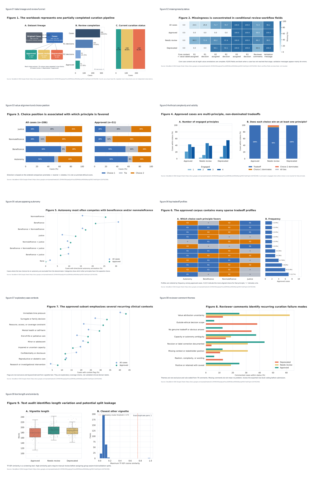

# ValueBench Clinical Ethics Corpus EDA

This repository contains the complete Python analysis and generated outputs for an exploratory data analysis of the ValueBench clinical ethics vignette corpus.

The project asks whether fine tuning can increase a clinical language model's attention to patient autonomy without reducing clinical coherence or factual accuracy. The dataset is unusual because it is not a conventional table of patient measurements or model outcomes. Each record is a constructed ethical dilemma with narrative text, two possible actions, categorical labels for four ethical principles, and fields that describe review and validation. The analysis therefore focuses on corpus composition, review workflow, ethical tradeoff structure, narrative coverage, and possible data leakage.

## Data source

The analysis uses the three tabs in the [ValueBench Google Sheet](https://docs.google.com/spreadsheets/d/1-Zhf4Nr59UqoeJLqhFwLoGDRH8uAuMGKdNqnigVO01Y/edit?gid=220762358):

| Tab | Role |
| --- | --- |
| `Cases` | Canonical current table with 286 unique cases and review fields |
| `Original Cases` | Earlier version used to audit text and label revisions |
| `Downloaded for mech interp` | Convenience extract with 20 rows and 10 unique case IDs |

The raw workbook is not committed. The script reads the public XLSX export directly, or it can use a downloaded copy supplied through `--input`.

Reviewer account identifiers are omitted from the public case level CSV. Review decisions and comments remain available because they are required for the workflow and qualitative analyses.

## Repository structure

```text
.
├── README.md
├── requirements.txt
├── data
│   └── README.md
├── src
│   └── valuebench_eda.py
└── outputs
    ├── analysis_summary.json
    ├── derived_case_level.csv
    ├── key_tables.md
    ├── figures
    │   ├── figure_01_*.png and .pdf
    │   └── figure_09_*.png and .pdf
    └── tables
        ├── table_01_*.csv
        └── table_20_*.csv
```

The repository intentionally excludes the written EDA report. The figures, tables, derived data, and code needed to support that report are included.

## Reproduce the analysis

Python 3.10 or later is recommended.

```bash
python -m venv .venv
source .venv/bin/activate
pip install -r requirements.txt
python src/valuebench_eda.py --output-dir outputs
```

If direct access to the Google Sheet export is unavailable, download the workbook as an XLSX file and run:

```bash
python src/valuebench_eda.py \
  --input /path/to/valuebench_eda.xlsx \
  --output-dir outputs
```

The script does not edit the Google Sheet. It validates the expected tabs and columns, constructs a one row per case analytic table, writes 20 CSV tables, and regenerates all nine figures in PNG and PDF formats.

## Main analytic choices

- All 286 cases are used to describe the candidate corpus and review pipeline.
- The 51 approved cases are treated as the current training ready subset.
- `Original Cases` is used only for revision auditing.
- Repeated rows in the mech interp extract are not counted as independent observations.
- `promotes`, `neutral`, and `violates` are ordered only to identify which choice each principle favors. The four principles are not summed into one ethics score.
- Reviewer comment themes and narrative context flags are transparent, nonexclusive, rule based exploratory codes.
- TF IDF similarity is used to screen for duplicates and possible paraphrases. It does not establish semantic equivalence.

## Generated figures

The analysis produces nine figures covering data lineage, missingness, choice position, ethical complexity, values opposing autonomy, tradeoff profiles, narrative contexts, reviewer feedback, and text similarity.



## Headline checks

- 286 unique current Case IDs
- 51 approved, 116 needing review, and 119 deprecated cases
- Complete vignette, choice, and value label fields for all 286 cases
- 11 automated validation errors, all in the pending group
- 51 of 51 approved cases classified as non dominated ethical tradeoffs
- One exact duplicate vignette pair crossing the approved and pending groups

Percentages in the outputs describe this constructed corpus. They should not be interpreted as population estimates for clinical practice.
